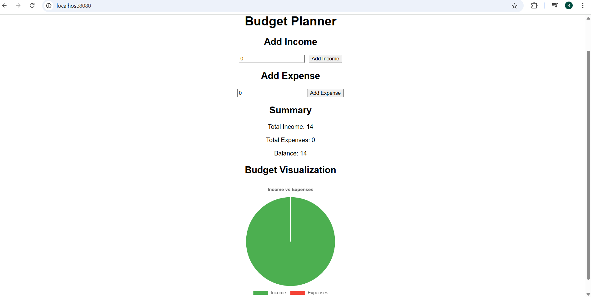

# budget-planner
An interactive budget planner built using Vue.js and Chart.js to track income, expenses, and visualize data with charts.

## Project setup
```bash
npm install

### Compiles and hot-reloads for development
```
npm run serve
```

### Compiles and minifies for production
```
npm run build
```

### Lints and fixes files
```
npm run lint
```

### Customize configuration
See [Configuration Reference](https://cli.vuejs.org/config/).



